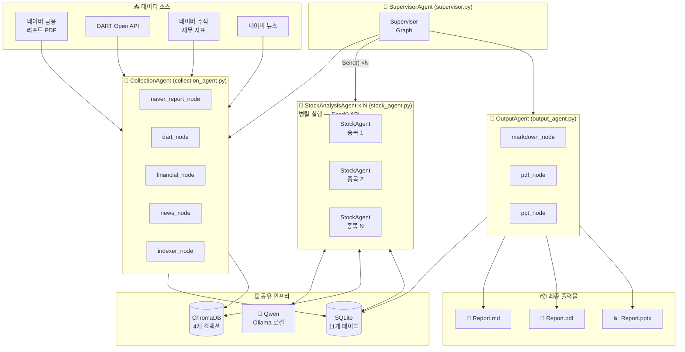
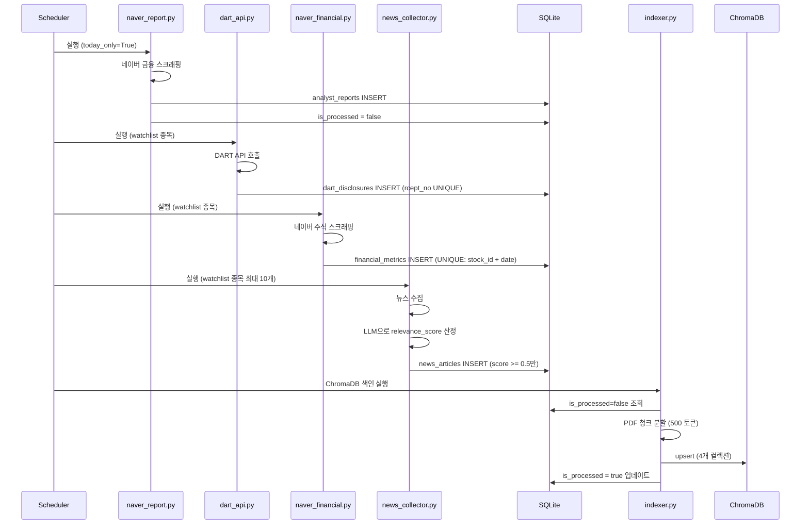
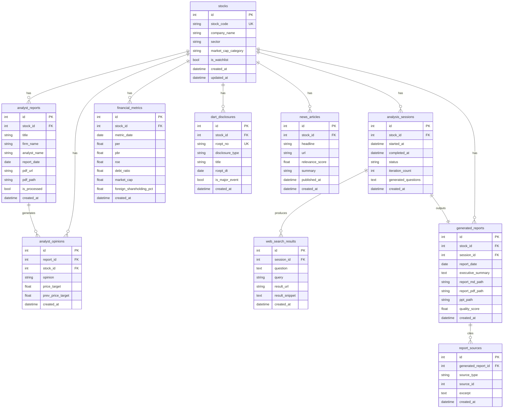
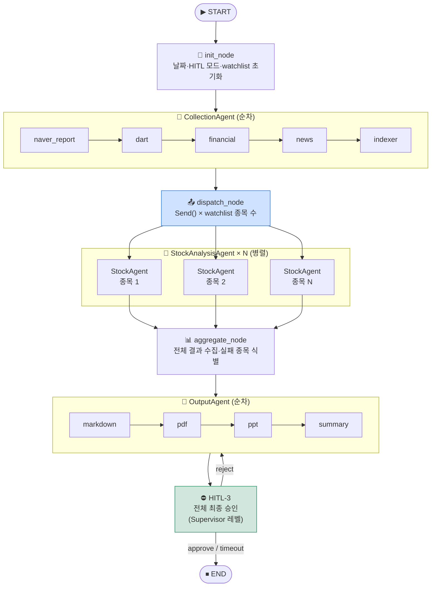
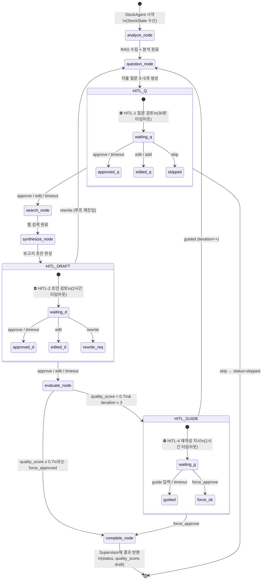
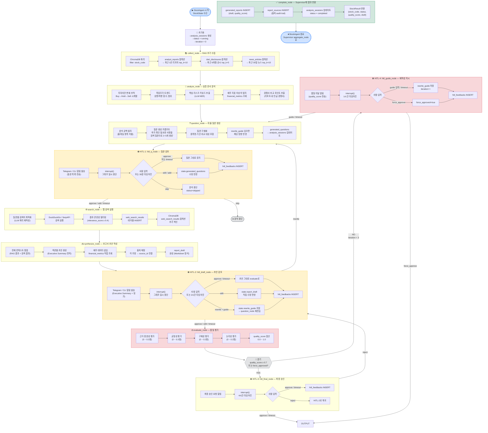
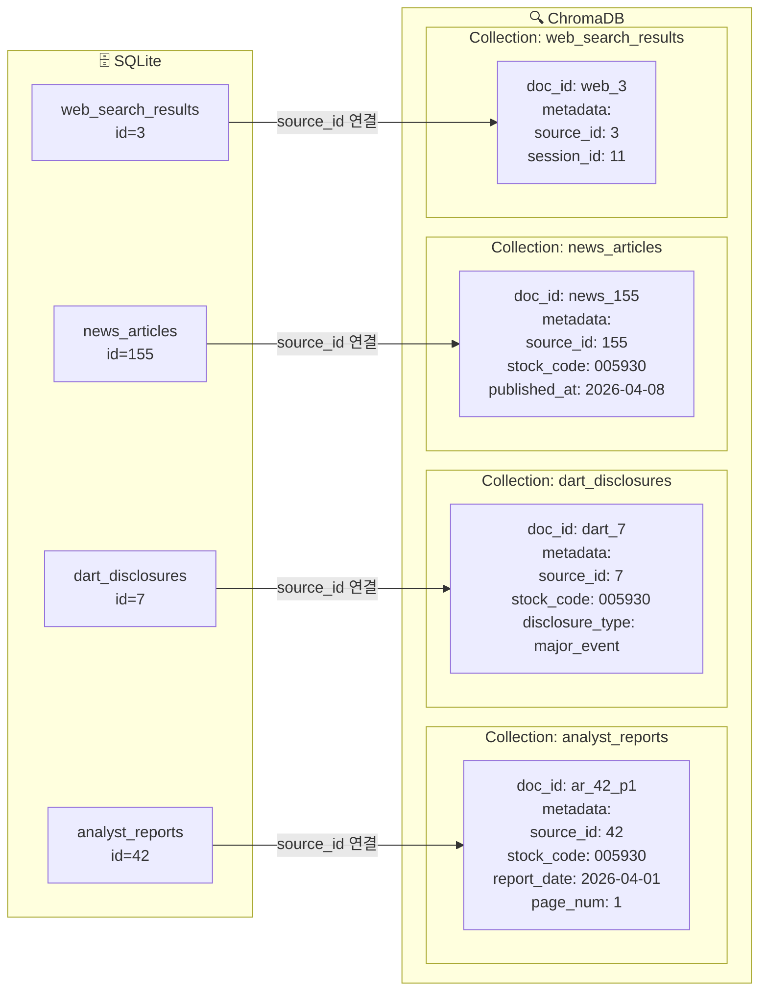

# 시스템 다이어그램

**작성일:** 2026-04-08  
**버전:** 1.2 (멀티 에이전트 전환)

---

## 1. 전체 시스템 아키텍처 (멀티 에이전트)

---

## 2. 데이터 수집 흐름

---

## 3. DB 관계도 (ERD)

---

## 4. Supervisor 오케스트레이션 — 멀티 에이전트 흐름

---

## 4-1. StockAnalysisAgent 내부 상태 그래프 (HITL 포함)

---

## 5. StockAnalysisAgent 노드별 상세 처리 흐름

---

## 6. 멀티 에이전트 State 구조

```mermaid
flowchart TB
    subgraph SUP_STATE["📋 SupervisorState\n(supervisor.py 보유)"]
        direction TB
        SS1["date: str"]
        SS2["hitl_mode: str"]
        SS3["watchlist: list[str]"]
        SS4["collection_done: bool"]
        SS5["stock_results: list[dict]\n{stock_code, status,\n quality_score, draft}"]
        SS6["failed_stocks: list[str]"]
        SS7["final_approved: bool"]
    end

    subgraph STOCK_STATE["📋 StockState\n(stock_agent.py 인스턴스별 독립 보유)"]
        direction TB
        SK1["stock_code: str"]
        SK2["company_name: str"]
        SK3["session_id: int"]
        SK4["collected_docs: list[dict]"]
        SK5["analysis_notes: str"]
        SK6["generated_questions: list[str]"]
        SK7["search_results: list[dict]"]
        SK8["report_draft: str"]
        SK9["quality_score: float"]
        SK10["iteration: int"]
        SK11["status: str"]
        SK12["hitl_mode: str"]
        SK13["human_q_feedback: dict|None"]
        SK14["human_draft_feedback: dict|None"]
        SK15["rewrite_guide: str|None"]
        SK16["force_approved: bool"]
    end

    subgraph FLOW["🔄 State 흐름"]
        direction LR
        F1["Supervisor\ndispatch_node"] -- "Send(StockState)" --> F2["StockAgent\n(인스턴스 N개)"]
        F2 -- "StockResult 반환" --> F3["Supervisor\naggregate_node"]
        F3 -- "stock_results 누적" --> F4["SupervisorState\n업데이트"]
    end

    SUP_STATE -.->|"dispatch 시 초기값 주입"| STOCK_STATE
    STOCK_STATE -.->|"완료 시 결과 반환"| SUP_STATE
```

---

## 7. ChromaDB ↔ SQLite 연결 구조

---

## 8. 일별 자동화 파이프라인 타임라인

```mermaid
gantt
    title 일별 자동화 타임라인 — 멀티 에이전트 (18:00 시작, SEMI-AUTO)
    dateFormat HH:mm
    axisFormat %H:%M

    section CollectionAgent (순차)
    naver_report_node        :collect1, 18:00, 10m
    dart_node                :collect2, after collect1, 5m
    financial_node           :collect3, after collect2, 10m
    news_node + indexer_node :collect4, after collect3, 25m

    section StockAgent 병렬 (Send × 3)
    종목1 분석+질문생성       :agent1a, after collect4, 20m
    종목2 분석+질문생성       :agent2a, after collect4, 20m
    종목3 분석+질문생성       :agent3a, after collect4, 20m

    section HITL-1 (종목별 독립 대기)
    ⛔ 종목1 질문 검토        :crit, h1a, after agent1a, 30m
    ⛔ 종목2 질문 검토        :crit, h1b, after agent2a, 30m
    ⛔ 종목3 질문 검토        :crit, h1c, after agent3a, 30m

    section StockAgent 병렬 (검색+초안)
    종목1 검색+초안           :agent1b, after h1a, 15m
    종목2 검색+초안           :agent2b, after h1b, 15m
    종목3 검색+초안           :agent3b, after h1c, 15m

    section HITL-2 (종목별 독립 대기)
    ⛔ 종목1 초안 검토        :crit, h2a, after agent1b, 120m
    ⛔ 종목2 초안 검토        :crit, h2b, after agent2b, 120m
    ⛔ 종목3 초안 검토        :crit, h2c, after agent3b, 120m

    section aggregate + OutputAgent
    aggregate_node           :agg, after h2a, 2m
    OutputAgent (MD+PDF+PPT) :out, after agg, 15m

    section HITL-3 (Supervisor 최종 승인)
    ⛔ 전체 최종 승인         :crit, h3, after out, 240m
```

