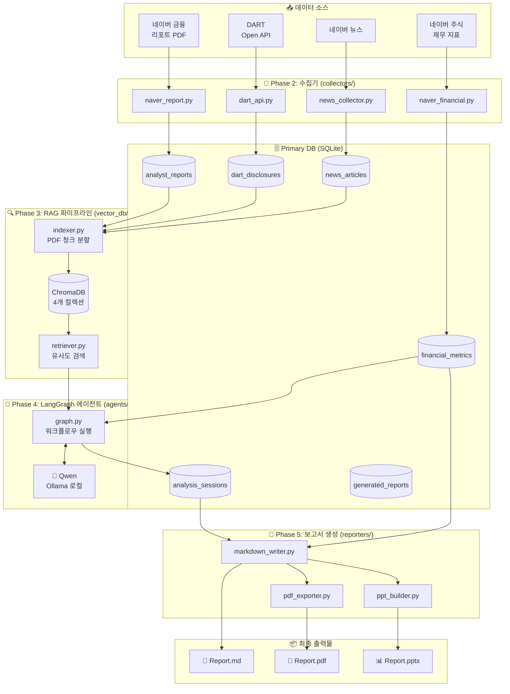
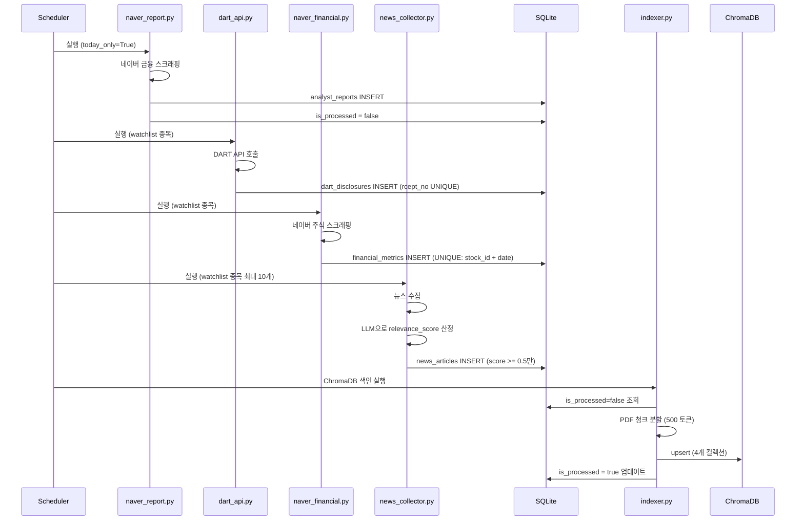
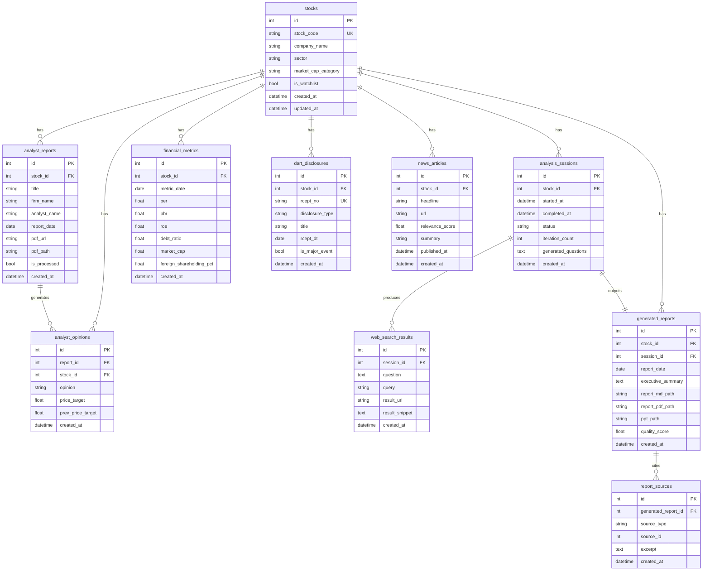
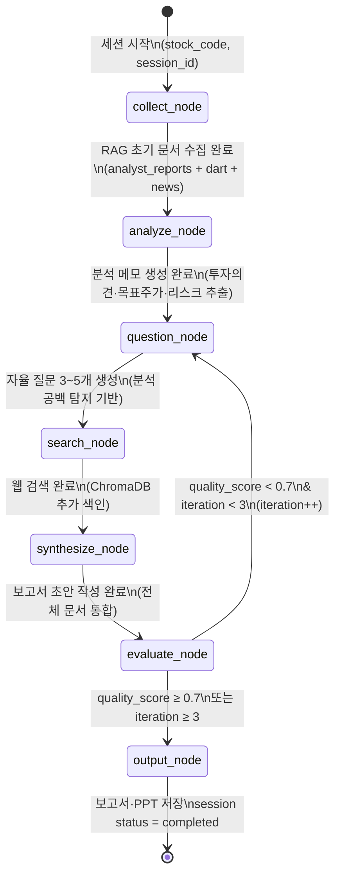
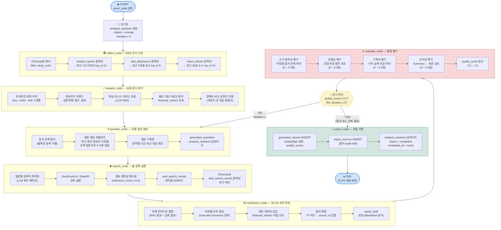
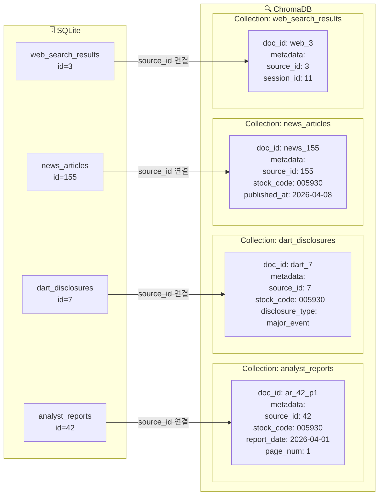

# 시스템 다이어그램

**작성일:** 2026-04-08

---

## 1. 전체 시스템 아키텍처

---

## 2. 데이터 수집 흐름

---

## 3. DB 관계도 (ERD)

---

## 4. LangGraph 워크플로우 — 전체 상태 그래프

---

## 5. LangGraph 노드별 상세 처리 흐름

---

## 6. LangGraph 상태(State) 전이 상세

```mermaid
flowchart LR
    subgraph State["📋 AgentState 스키마"]
        direction TB
        ST1["stock_code: str"]
        ST2["company_name: str"]
        ST3["session_id: int"]
        ST4["collected_docs: list[dict]\n(RAG 검색 결과 누적)"]
        ST5["analysis_notes: str\n(중간 분석 메모)"]
        ST6["generated_questions: list[str]"]
        ST7["search_results: list[dict]"]
        ST8["report_draft: str"]
        ST9["quality_score: float"]
        ST10["iteration: int\n(최대 3)"]
        ST11["status: str\nrunning/completed/failed"]
    end

    subgraph Mutations["🔄 노드별 State 변경"]
        direction TB
        M1["collect_node\n→ collected_docs 채움"]
        M2["analyze_node\n→ analysis_notes 채움"]
        M3["question_node\n→ generated_questions 채움"]
        M4["search_node\n→ search_results 추가\n→ collected_docs 확장"]
        M5["synthesize_node\n→ report_draft 채움"]
        M6["evaluate_node\n→ quality_score 산정\n→ iteration 증가"]
        M7["output_node\n→ status = completed"]
    end

    State -.-> Mutations
```

---

## 7. ChromaDB ↔ SQLite 연결 구조

---

## 8. 일별 자동화 파이프라인 타임라인

```mermaid
gantt
    title 일별 자동화 실행 타임라인 (18:00 시작)
    dateFormat HH:mm
    axisFormat %H:%M

    section 데이터 수집
    네이버 리포트 수집       :collect1, 18:00, 10m
    DART 공시 수집           :collect2, after collect1, 5m
    재무 지표 수집           :collect3, after collect2, 10m
    뉴스 수집 + 스코어링     :collect4, after collect3, 15m

    section RAG 색인
    ChromaDB 신규 색인       :index, after collect4, 10m

    section AI 분석 (종목별)
    종목 1 LangGraph 실행    :agent1, after index, 20m
    종목 2 LangGraph 실행    :agent2, after index, 20m
    종목 3 LangGraph 실행    :agent3, after index, 20m

    section 보고서 생성
    MD 보고서 생성           :report1, after agent1, 5m
    PDF 변환                 :report2, after report1, 3m
    PPT 생성                 :report3, after report2, 5m
```

