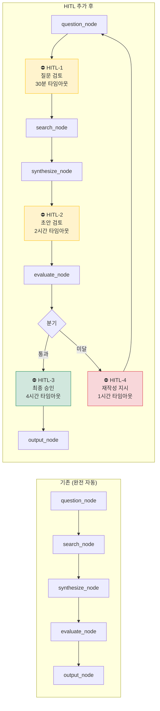

# Human in the Loop (HITL) 전략

**작성일:** 2026-04-08  
**버전:** 1.0  
**연관 문서:** implementation_plan.md, diagrams.md, test_strategy.md

---

## 1. HITL 도입 이유

현재 설계는 완전 자동화 파이프라인이지만, 주식 분석이라는 도메인 특성상 아래 리스크가 존재한다.

| 리스크 | 설명 |
|--------|------|
| LLM 환각 | 잘못된 수치·날짜가 보고서에 삽입될 수 있음 |
| 편향된 분석 | 긍정/부정 한쪽으로 치우친 보고서 |
| 수집 오류 | 스크래핑 파싱 실패로 엉뚱한 데이터가 적재됨 |
| 질문 품질 | 자율 생성 질문이 너무 일반적이어서 검색 가치 없음 |
| 최종 책임 | 투자 판단에 직결되므로 사람의 최종 검토 필요 |

**HITL 목표:** 자동화의 효율성은 유지하면서, 사람이 꼭 봐야 할 지점에만 개입하여 품질과 신뢰성 확보

---

## 2. HITL 개입 지점 (Interrupt Points) 설계

LangGraph의 `interrupt()` 기능을 활용하여 그래프 실행을 일시 중지하고 사람의 입력을 기다린다.

```
워크플로우에서 HITL 개입 지점 4곳:

[START]
  ↓
[collect_node]
  ↓
[analyze_node]
  ↓
[question_node]
  ↓
⛔ HITL-1: 질문 검토 & 편집          ← 사람이 질문을 수정/추가/삭제
  ↓ (승인)
[search_node]
  ↓
[synthesize_node]
  ↓
⛔ HITL-2: 보고서 초안 검토          ← 사람이 초안을 직접 편집 또는 승인
  ↓ (승인)
[evaluate_node]
  ↓
  ├── quality_score ≥ 0.7 → ⛔ HITL-3: 최종 승인  ← 배포 전 최종 사인오프
  └── quality_score < 0.7 → ⛔ HITL-4: 재작성 지시 ← 방향 가이드 제공 후 루프
  ↓ (승인)
[output_node]
  ↓
[END]
```

### 개입 지점별 상세

#### HITL-1: 질문 검토 (question_node 직후)

```
목적: LLM이 생성한 자율 질문의 품질 보완
트리거: 항상 (매 분석 세션)

사람이 할 수 있는 행동:
  ✅ 질문 승인 (그대로 진행)
  ✅ 질문 수정 (더 구체적으로 편집)
  ✅ 질문 삭제 (관련 없는 질문 제거)
  ✅ 질문 추가 (사람이 직접 질문 입력)
  ✅ 건너뜀 (해당 종목 분석 중단)

대기 시간 제한: 30분 → 초과 시 원래 질문으로 자동 진행 (타임아웃 모드)
알림 방법: Telegram 메시지 (기존 Telegram MCP 활용 가능)
```

#### HITL-2: 보고서 초안 검토 (synthesize_node 직후)

```
목적: LLM 환각·편향·오류 수정
트리거: 항상 (매 분석 세션)

사람이 할 수 있는 행동:
  ✅ 초안 승인 → evaluate_node로 진행
  ✅ 텍스트 직접 편집 후 승인
  ✅ 재작성 요청 + 가이드 텍스트 입력
       예: "반도체 업황 리스크를 더 강조해줘"
  ✅ 데이터 오류 지적
       예: "PER 수치가 틀림, 실제는 12.3"

대기 시간 제한: 2시간 → 초과 시 자동 승인 (비간섭 모드)
```

#### HITL-3: 최종 승인 (output_node 직전, 품질 통과 시)

```
목적: 보고서 배포 전 최종 사인오프
트리거: quality_score ≥ 0.7

사람이 할 수 있는 행동:
  ✅ 최종 승인 → 파일 저장 + 배포
  ✅ 반려 → HITL-2로 복귀
  ✅ 조건부 승인 → 특정 섹션만 수정 후 저장

대기 시간 제한: 4시간 → 초과 시 자동 저장 (Draft 상태로)
```

#### HITL-4: 재작성 지시 (evaluate_node, 품질 미달 시)

```
목적: 루프 재진입 전 사람이 방향 제시
트리거: quality_score < 0.7 AND iteration < 3

사람이 할 수 있는 행동:
  ✅ 재작성 방향 가이드 입력
       예: "최근 실적 발표 내용을 중심으로 재작성"
  ✅ 강제 승인 (품질 미달이지만 그대로 사용)
  ✅ 분석 중단

대기 시간 제한: 1시간 → 초과 시 기존 로직대로 자동 루프 재진입
```

---

## 3. 운영 모드 설계

일별 운영 상황에 따라 HITL 개입 수준을 조절할 수 있도록 3가지 모드 제공

```
Mode A: FULL-AUTO (완전 자동)
  - 모든 HITL 지점 비활성화
  - 타임아웃 시 자동 진행 기본값 적용
  - 사용 시점: 테스트·백테스트, 사용자 부재 시

Mode B: SEMI-AUTO (반자동, 기본 권장)
  - HITL-1 (질문 검토): 활성화 (30분 타임아웃)
  - HITL-2 (초안 검토): 활성화 (2시간 타임아웃)
  - HITL-3 (최종 승인): 비활성화 (자동 저장)
  - HITL-4 (재작성): 비활성화 (자동 루프)
  - 사용 시점: 일상 운영

Mode C: FULL-REVIEW (완전 검토)
  - 모든 HITL 지점 활성화
  - 타임아웃 없음 (무한 대기)
  - 사용 시점: 중요 종목, 중요 리포트 발행 전
```

### config.py에 추가할 설정

```
HITL_MODE: str = "SEMI-AUTO"          # FULL-AUTO / SEMI-AUTO / FULL-REVIEW
HITL_TIMEOUT_Q: int = 30              # 질문 검토 타임아웃 (분)
HITL_TIMEOUT_DRAFT: int = 120         # 초안 검토 타임아웃 (분)
HITL_TIMEOUT_FINAL: int = 240         # 최종 승인 타임아웃 (분)
HITL_NOTIFY_METHOD: str = "telegram"  # telegram / cli / none
```

---

## 4. 알림 및 인터페이스 전략

### 알림 방법: Telegram (기존 MCP 활용)

```
HITL-1 알림 메시지 예시:
  ┌─────────────────────────────┐
  │ 📋 [질문 검토 요청]          │
  │ 종목: 삼성전자 (005930)      │
  │                             │
  │ 생성된 질문 (3개):           │
  │ 1. 최근 HBM 수주 현황은?    │
  │ 2. 파운드리 가동률 전망?     │
  │ 3. 경쟁사 TSMC 대비 현황?   │
  │                             │
  │ 명령어:                      │
  │ /approve  → 그대로 진행     │
  │ /edit 1 새질문 → 1번 수정   │
  │ /add 추가질문 → 질문 추가   │
  │ /skip  → 분석 건너뜀        │
  │                             │
  │ ⏱ 30분 후 자동 승인         │
  └─────────────────────────────┘

HITL-2 알림 메시지 예시:
  ┌─────────────────────────────┐
  │ 📝 [보고서 초안 검토 요청]   │
  │ 종목: 삼성전자 (005930)      │
  │ quality_score: 0.82          │
  │                             │
  │ Executive Summary:          │
  │ "투자의견 Buy, 목표주가..."  │
  │ (전체 보고서: 링크)          │
  │                             │
  │ /approve  → 최종 승인       │
  │ /rewrite 가이드 → 재작성    │
  │ /edit 섹션명 수정내용       │
  │                             │
  │ ⏱ 2시간 후 자동 승인        │
  └─────────────────────────────┘
```

### CLI 대안 인터페이스 (Telegram 미사용 시)

```
터미널에 대기 프롬프트 출력:

  [HITL-1] 삼성전자 - 질문 검토
  생성된 질문:
    1. 최근 HBM 수주 현황은?
    2. 파운드리 가동률 전망?
    3. 경쟁사 TSMC 대비 현황?

  > [A]pprove / [E]dit / [S]kip: _
```

---

## 5. DB 스키마 변경 사항

HITL 상태를 추적하기 위해 기존 테이블과 새 테이블이 필요하다.

### 5-1. analysis_sessions 테이블 컬럼 추가

```
기존 컬럼에 추가:

  hitl_mode        VARCHAR(20)   DEFAULT 'SEMI-AUTO'
  hitl_q_status    VARCHAR(20)   DEFAULT 'pending'
                                 # pending / approved / edited / skipped / timeout
  hitl_draft_status VARCHAR(20)  DEFAULT 'pending'
                                 # pending / approved / rewrite_requested / timeout
  hitl_final_status VARCHAR(20)  DEFAULT 'pending'
                                 # pending / approved / rejected / timeout
```

### 5-2. hitl_feedbacks 테이블 신규 추가

```
목적: 사람이 입력한 피드백·수정 내용 이력 저장

컬럼:
  id                INTEGER       PK
  session_id        INTEGER       FK→analysis_sessions
  hitl_point        VARCHAR(20)   HITL-1 / HITL-2 / HITL-3 / HITL-4
  action            VARCHAR(30)   approved / edited / rewrite / skipped / force_approved
  original_content  TEXT          사람 개입 전 내용
  revised_content   TEXT          사람이 수정한 내용 (없으면 NULL)
  feedback_text     TEXT          재작성 가이드 텍스트
  responded_at      DATETIME
  response_latency_min INTEGER    응답까지 걸린 시간(분)
  created_at        DATETIME      DEFAULT now()
```

### 5-3. ERD 변경 요약

```
analysis_sessions (1) ──── (N) hitl_feedbacks
```

---

## 6. LangGraph 워크플로우 변경

### 변경 전 (현재)

```
question_node → search_node → synthesize_node → evaluate_node → [분기]
```

### 변경 후 (HITL 추가)

```
question_node
  ↓
[interrupt: HITL-1]  ← 30분 타임아웃, Telegram 알림
  ↓ (human_input or timeout)
[hitl_q_node]        ← 피드백 적용 (질문 수정/추가/삭제)
  ↓
search_node
  ↓
synthesize_node
  ↓
[interrupt: HITL-2]  ← 2시간 타임아웃
  ↓ (human_input or timeout)
[hitl_draft_node]    ← 피드백 적용 (초안 수정 or 재작성 플래그)
  ↓
evaluate_node
  ↓
[분기]
  ├── 통과 → [interrupt: HITL-3] → output_node
  └── 미달 → [interrupt: HITL-4] → [hitl_guide_node] → question_node (루프)
```

### 새로 추가되는 LangGraph 노드

| 노드 | 역할 |
|------|------|
| `hitl_q_node` | HITL-1 피드백 적용: state.generated_questions 업데이트 |
| `hitl_draft_node` | HITL-2 피드백 적용: state.report_draft 수정 or rewrite 플래그 설정 |
| `hitl_guide_node` | HITL-4 피드백 적용: state.rewrite_guide 업데이트 후 루프 재진입 |

### State 스키마 추가 필드

```
기존 AgentState에 추가:

  hitl_mode: str                      # FULL-AUTO / SEMI-AUTO / FULL-REVIEW
  human_q_feedback: dict | None       # 질문 검토 피드백
  human_draft_feedback: dict | None   # 초안 검토 피드백
  rewrite_guide: str | None           # 재작성 방향 가이드
  force_approved: bool                # 품질 미달 강제 승인 여부
```

---

## 7. 기존 문서별 수정 사항

### implementation_plan.md 수정 필요 항목

```
1. 디렉터리 구조에 추가:
   agents/
     └── nodes/
           └── hitl.py    ← hitl_q_node / hitl_draft_node / hitl_guide_node

2. Phase 4 (LangGraph) 노드 목록에 HITL 노드 3개 추가

3. config.py 항목에 HITL 설정 4개 추가

4. Phase 1 완료 기준에 추가:
   - hitl_feedbacks 테이블 생성 확인
   - analysis_sessions에 hitl_* 컬럼 추가 확인
```

### diagrams.md 수정 필요 항목

```
1. 다이어그램 5 (LangGraph 노드별 상세 처리 흐름):
   - question_node 이후 HITL-1 interrupt 박스 추가
   - synthesize_node 이후 HITL-2 interrupt 박스 추가
   - evaluate_node 이후 HITL-3/4 분기 추가

2. 다이어그램 4 (stateDiagram-v2):
   - HITL interrupt 상태 추가
   - timeout → 자동 진행 전이 표현

3. 다이어그램 8 (Gantt):
   - HITL 대기 시간 구간 추가
     (질문 검토 30분, 초안 검토 2시간)
```

### test_strategy.md 수정 필요 항목

```
Phase 4 테스트에 추가:

  HITL 단위 테스트:
    - 타임아웃 시 자동 진행 동작 확인
    - 질문 수정 피드백 → state.generated_questions 반영 확인
    - 강제 승인 → quality_score 미달이지만 output_node 진행 확인

  HITL 통합 테스트:
    - Mock 사람 입력(approve/edit/rewrite)으로 시나리오별 실행
    - hitl_feedbacks 테이블 레코드 생성 확인
    - response_latency_min 정상 기록 확인

  FULL-AUTO 모드 테스트:
    - HITL 개입 없이 end-to-end 완주 확인 (기존 E2E 테스트와 동일)
```

---

## 8. HITL 도입 전후 비교



---

## 9. 구현 우선순위 추가 체크리스트

```
HITL Phase 완료 기준:

  DB 변경:
  - [ ] analysis_sessions 테이블에 hitl_* 컬럼 4개 추가
  - [ ] hitl_feedbacks 테이블 신규 생성

  LangGraph 변경:
  - [ ] AgentState에 HITL 관련 필드 추가
  - [ ] interrupt() 지점 4곳 삽입
  - [ ] hitl_q_node / hitl_draft_node / hitl_guide_node 구현
  - [ ] HITL_MODE 별 조건 분기 (FULL-AUTO면 interrupt 스킵)

  알림 연동:
  - [ ] Telegram 알림 메시지 템플릿 작성
  - [ ] /approve, /edit, /skip 명령어 파싱 로직

  테스트:
  - [ ] 타임아웃 자동 진행 시나리오 검증
  - [ ] Mock 사람 입력으로 각 HITL 지점 단위 테스트
  - [ ] SEMI-AUTO 모드 E2E 테스트
```
