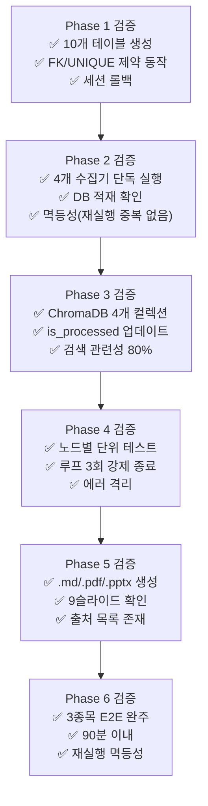

# 테스트 및 검증 전략

**작성일:** 2026-04-08  
**버전:** 1.0

---

## 1. 테스트 전략 개요

### 기본 원칙

- **외부 의존성 격리:** 네이버·DART·웹 검색은 실제 호출 대신 저장된 픽스처(fixture) 사용
- **멱등성 우선:** 같은 입력에 같은 결과 → 재실행해도 DB 중복 없음
- **단계별 검증:** 각 Phase 완료 시점에 독립적으로 검증 가능한 기준 설정
- **LLM 출력 검증:** 확률적 출력이므로 정확값 비교 대신 구조·형식·범위 검증

### 테스트 레벨

```
Unit Test      → 개별 함수·클래스 단위 (외부 의존성 Mock)
Integration    → 모듈 간 연동 (실제 SQLite, 실제 ChromaDB)
E2E Test       → 전체 파이프라인 (단일 종목 end-to-end)
Data Quality   → 수집 데이터 정합성 검증
LLM Eval       → 에이전트 출력 품질 평가
```

---

## 2. Phase별 테스트 계획

---

### Phase 1: 기반 인프라 테스트

#### 1-1. DB 스키마 검증

```
테스트 항목:
  ✅ init_db() 실행 후 10개 테이블 존재 확인
  ✅ 각 테이블의 컬럼명·타입·제약 조건 일치 확인
  ✅ FK 제약: stocks.id 없이 analyst_reports INSERT 시도 → 실패
  ✅ UNIQUE 제약:
       - stocks.stock_code 중복 INSERT → 실패
       - financial_metrics (stock_id, metric_date) 중복 → 실패
       - dart_disclosures.rcept_no 중복 → 실패
  ✅ DEFAULT 값: created_at 미입력 → 현재 시각 자동 삽입

실행 방법:
  sqlite3 data/stock_analysis.db ".tables"
  sqlite3 data/stock_analysis.db "PRAGMA table_info(analyst_reports);"
```

#### 1-2. 세션 관리 검증

```
테스트 항목:
  ✅ get_session() 정상 커밋 → DB 반영 확인
  ✅ 예외 발생 시 자동 롤백 → 중간 데이터 없음 확인
  ✅ 세션 닫힘 후 재쿼리 시도 → 명확한 에러 발생 확인
```

---

### Phase 2: 데이터 수집기 테스트

#### 2-1. naver_report.py

```
Unit Test (Mock 사용):
  - fetch_report_list() Mock:
      입력: 네이버 HTML 샘플 파일 (fixtures/naver_report_page1.html)
      검증: 반환된 dict 리스트의 키 존재 (stock, title, firm, date, pdf_url)
      검증: is_today() 필터 정상 동작

  - safe_filename() 검증:
      입력: "삼성전자/LG전자:2026.04.08*테스트<리포트>"
      기대: 특수문자 → "_" 치환, 파일시스템 안전 문자열 반환

Integration Test (실제 SQLite):
  - 픽스처 리포트 3건 INSERT → analyst_reports 레코드 3개 확인
  - 동일 pdf_url 재실행 → 중복 INSERT 없음 (멱등성)
  - stocks 테이블에 없는 종목명 → stocks 자동 INSERT 확인

수동 검증 (실제 네트워크):
  - python collectors/naver_report.py --dry-run
    (DB INSERT 없이 수집 결과만 콘솔 출력)
  - 출력 확인: 종목명, 증권사, 날짜, PDF URL 정상 파싱 여부
```

#### 2-2. dart_api.py

```
Unit Test (Mock 사용):
  - DART API 응답 픽스처 (fixtures/dart_list_response.json)
  - corp_code 매핑 로직 단위 검증
  - is_major_event 판별 로직:
      입력: "제3자배당부사채권발행결정" → True
      입력: "분기보고서" → False

Integration Test:
  - 픽스처 공시 5건 INSERT → dart_disclosures 5건 확인
  - rcept_no 동일 건 재실행 → INSERT OR IGNORE (0건 추가)
  - is_major_event=True 건만 필터 조회 정상 동작

수동 검증 (실제 DART API):
  DART API 키 설정 후:
  - python collectors/dart_api.py --stock-code 005930 --days 7
  - 콘솔 출력 확인, dart_disclosures 테이블 레코드 확인
```

#### 2-3. naver_financial.py

```
Unit Test (Mock):
  - 네이버 주식 메인 HTML 픽스처 (fixtures/naver_stock_005930.html)
  - PER·PBR·ROE 파싱 로직 검증
  - N/A 또는 "-" 값 → NULL 처리 확인

Integration Test:
  - 동일 (stock_id, metric_date) 재실행 → 중복 없음 (UNIQUE 제약)
  - 오늘 날짜 레코드 없을 때만 INSERT 동작 확인

데이터 품질 검증:
  ✅ PER 범위: 0 < PER < 500 (이상치 경고)
  ✅ 부채비율: 0 < debt_ratio (음수 불가)
  ✅ 외국인 보유비율: 0 ≤ value ≤ 100
```

#### 2-4. news_collector.py

```
Unit Test (Mock):
  - 뉴스 HTML 픽스처 파싱 검증
  - relevance_score 필터 (0.5 미만 제외) 로직 검증

LLM 연동 테스트:
  - Ollama 실행 중인지 확인:
      curl http://localhost:11434/api/tags
  - 더미 뉴스 헤드라인 5개로 relevance_score 생성 테스트
  - 반환값 타입: float, 범위: 0.0 ≤ score ≤ 1.0

Integration Test:
  - watchlist 종목 1개로 뉴스 수집 실행
  - news_articles 레코드 1~5건 확인
  - relevance_score, summary 컬럼 NULL이 아닌지 확인
```

---

### Phase 3: RAG 파이프라인 테스트

#### 3-1. indexer.py — 색인 검증

```
Unit Test:
  - PDF 청크 분할 검증:
      입력: fixtures/sample_report.pdf (5페이지)
      기대: 청크 수 ≥ 5, 각 청크 500 토큰 이하
      기대: 청크에 page_num 메타데이터 포함

Integration Test (실제 ChromaDB):
  - 픽스처 PDF 1건 색인
  - analyst_reports 컬렉션 document count 증가 확인
  - analyst_reports.is_processed = true 업데이트 확인
  - 동일 PDF 재실행 → upsert (중복 없음)

수동 검증:
  - ChromaDB 컬렉션별 document count 조회
  - 간단한 쿼리 테스트:
      query="삼성전자 영업이익 전망", filter={"stock_code": "005930"}
      기대: 관련 청크 반환
```

#### 3-2. retriever.py — 검색 품질 검증

```
검색 정확도 테스트 세트 (10개 쿼리):

  쿼리 1: "삼성전자 반도체 업황 전망"
  기대: analyst_reports 컬렉션에서 반도체 관련 청크 반환
  검증: 반환 문서의 stock_code == "005930"

  쿼리 2: "유상증자 공시"
  기대: dart_disclosures 컬렉션에서 유상증자 관련 문서 반환
  검증: source_type == "dart"

  쿼리 3: 관련 없는 쿼리 ("날씨 맑음 강수 확률")
  기대: 낮은 similarity score → 빈 결과 또는 필터 아웃

검증 지표:
  - 상위 5건 중 stock_code 일치율 ≥ 80%
  - 응답 지연 ≤ 2초 (로컬 ChromaDB 기준)
  - 출처 메타데이터 (source_type, source_id) 누락 없음
```

---

### Phase 4: LangGraph 에이전트 테스트

#### 4-1. 개별 노드 단위 테스트

```
collect_node:
  입력: stock_code="005930", 픽스처 ChromaDB (미리 색인된 더미 문서)
  검증: state.collected_docs 리스트 비어 있지 않음
  검증: 각 doc에 source_type, source_id, content 키 존재

analyze_node:
  입력: collected_docs (픽스처 5건)
  검증: state.analysis_notes 비어 있지 않음 (len > 100)
  검증: 투자의견 언급 포함 여부 (Buy/Hold/Sell 키워드)

question_node:
  입력: analysis_notes (픽스처 텍스트)
  검증: generated_questions 리스트 길이 3 ≤ n ≤ 5
  검증: 각 질문이 종목명 또는 관련 키워드 포함
  검증: 질문 문자열 길이 ≥ 10 (너무 짧은 질문 방지)

search_node:
  입력: generated_questions (픽스처 3개 질문)
  Mock: DuckDuckGo 검색 결과 → 픽스처 응답 반환
  검증: web_search_results DB INSERT 확인
  검증: ChromaDB web_search_results 컬렉션 document 추가 확인

evaluate_node:
  입력: report_draft (픽스처 보고서 초안 3종)
    - 초안 A: 근거 충분, 수치 포함 → quality_score 높음 기대
    - 초안 B: 주장만 있고 출처 없음 → quality_score 낮음 기대
    - 초안 C: 한쪽 의견만 → 균형성 낮음 기대
  검증: 초안 A score > 초안 B score > 0
  검증: score 범위 0.0 ≤ score ≤ 1.0
```

#### 4-2. 워크플로우 루프 테스트

```
시나리오 1: 1회차 통과
  설정: evaluate_node가 항상 0.8 반환 (Mock)
  기대: iteration = 1, status = completed

시나리오 2: 2회 루프 후 통과
  설정: 1회차 0.5, 2회차 0.75 반환 (Mock)
  기대: iteration = 2, question_node 2회 실행

시나리오 3: 강제 종료 (3회 미달)
  설정: evaluate_node가 항상 0.4 반환 (Mock)
  기대: iteration = 3, status = completed (강제 종료)
  검증: 무한 루프 없음

시나리오 4: 에러 처리
  설정: search_node에서 네트워크 예외 발생
  기대: status = failed, analysis_sessions 업데이트 확인
  검증: 다음 종목 실행에 영향 없음 (격리)
```

#### 4-3. E2E 에이전트 테스트

```
실행 방법:
  python agents/graph.py --stock-code 005930 --mock-llm

Mock LLM 사용 이유:
  - 실제 LLM은 응답 시간이 길고 비결정적
  - E2E 구조 검증이 목적 (LLM 품질 검증은 별도)

검증 항목:
  ✅ analysis_sessions 레코드 생성 (status=running → completed)
  ✅ web_search_results 레코드 ≥ 3건
  ✅ generated_reports 레코드 1건
  ✅ report_sources 레코드 ≥ 1건
  ✅ quality_score 컬럼 NULL이 아님
  ✅ iteration_count ≤ 3
  ✅ completed_at > started_at
```

---

### Phase 5: 보고서 생성 테스트

#### 5-1. markdown_writer.py

```
입력:
  - 픽스처 report_draft (Markdown 텍스트)
  - DB: financial_metrics 3개년 데이터 (픽스처)
  - DB: analyst_opinions 최근 5건 (픽스처)
  - DB: report_sources 10건 (픽스처)

검증:
  ✅ 출력 파일 생성: reports/YYYY-MM-DD/{stock_code}_report.md
  ✅ 필수 섹션 존재:
       ## Executive Summary
       ## 재무 분석
       ## 애널리스트 컨센서스
       ## 리스크 요인
       ## 출처
  ✅ 재무 테이블에 PER, PBR, ROE 컬럼 존재
  ✅ 출처 목록에 최소 1건 이상 URL 포함
```

#### 5-2. pdf_exporter.py

```
검증:
  ✅ .pdf 파일 생성 확인
  ✅ 파일 크기 > 10KB (빈 파일 방지)
  ✅ PDF 열기 오류 없음 (PyPDF로 재파싱 시도)

도구 의존성 사전 확인:
  pandoc --version  또는
  python -c "import weasyprint; print('OK')"
```

#### 5-3. ppt_builder.py

```
검증:
  ✅ .pptx 파일 생성 확인
  ✅ 슬라이드 수 = 9
  ✅ 각 슬라이드 제목 텍스트 존재 (빈 슬라이드 방지)
  ✅ 슬라이드 5~6: 재무 지표 수치 텍스트 포함

python-pptx로 자동 검증:
  prs = Presentation("report.pptx")
  assert len(prs.slides) == 9
```

---

### Phase 6: 전체 파이프라인 E2E 테스트

```
목적: 스케줄러가 실제 환경에서 완주하는지 검증

테스트 환경:
  - 관심종목 3개 등록 (대형주 권장: 005930, 000660, 035420)
  - Ollama + Qwen 실행 중
  - DART API 키 설정 완료

실행:
  python scheduler/daily_runner.py --date 2026-04-08

성공 기준:
  ✅ Step 1~5 모두 오류 없이 완료
  ✅ reports/2026-04-08/ 디렉터리에 종목별 .md, .pdf, .pptx 생성
  ✅ 실행 시간 ≤ 90분 (종목 3개 기준)
  ✅ 재실행 시 중복 데이터 없음 (멱등성)

실패 시 격리 검증:
  - 종목 1 DART 수집 실패 → 종목 2, 3 정상 실행 확인
  - 종목 2 LLM 응답 실패 → status=failed 기록, 종목 3 정상 실행 확인
```

---

## 3. 데이터 품질 검증 규칙

### 수집 데이터 이상치 탐지

```
financial_metrics 검증 규칙:
  - PER:  0 < value < 500         이상치 → 경고 로그
  - PBR:  0 < value < 50          이상치 → 경고 로그
  - ROE:  -100 < value < 100      이상치 → 경고 로그
  - 부채비율: value ≥ 0           음수 → 오류
  - 외국인 보유비율: 0 ≤ value ≤ 100  범위 초과 → 오류

analyst_opinions 검증 규칙:
  - opinion 값: Buy, Hold, Sell, Neutral 중 하나
  - price_target: value > 0
  - price_target 급변 감지:
      abs(price_target - prev_price_target) / prev_price_target > 0.3
      → 30% 이상 급변 시 경고 로그

news_articles 검증 규칙:
  - relevance_score: 0.0 ≤ value ≤ 1.0
  - published_at: 미래 날짜 불가
  - headline 길이: 5 ≤ len ≤ 500
```

### 일별 수집량 기준치

```
정상 범위 (경고 임계값):

  analyst_reports:
    - 하루 신규 리포트 < 5건 → 수집 이상 경고
    - 하루 신규 리포트 > 100건 → 중복 수집 의심

  dart_disclosures (watchlist 10종목 기준):
    - 0건 → DART API 연결 오류 의심

  financial_metrics:
    - watchlist 종목 수와 불일치 → 수집 누락 경고

  news_articles:
    - 종목당 0건 → 뉴스 수집 오류 의심
    - 종목당 > 10건 → 필터 로직 점검 필요
```

---

## 4. LLM 출력 품질 평가 전략

### 비결정적 출력 검증 원칙

LLM 출력은 매번 달라지므로 **정확값 비교 불가** → 아래 기준으로 검증

```
구조 검증 (필수):
  - 반환 타입이 예상 타입과 일치
  - 필수 키/섹션 존재 여부
  - 길이 범위 준수

범위 검증 (필수):
  - relevance_score: 0.0 ≤ float ≤ 1.0
  - quality_score: 0.0 ≤ float ≤ 1.0
  - generated_questions: 3 ≤ len(list) ≤ 5

내용 검증 (샘플링):
  - 보고서에 종목명 포함 여부
  - 출처 문서의 날짜와 보고서 날짜 범위 일치
  - 투자의견이 Buy/Hold/Sell 중 하나
```

### LLM 평가 세트 (Eval Set)

```
10개 종목 × 고정 픽스처 데이터로 반복 평가:

  평가 1: 질문 생성 품질
    - 생성된 질문이 해당 종목과 관련 있는가 (수동 채점 1~5)
    - 질문이 구체적인가 (막연한 질문 vs 날짜/수치 포함)

  평가 2: 보고서 품질
    - Executive Summary가 본문 내용을 정확히 요약하는가
    - 재무 수치가 DB 데이터와 일치하는가 (자동 검증 가능)
    - 출처 없이 주장만 있는 문장 비율 (낮을수록 좋음)

  평가 3: 일관성
    - 동일 입력으로 3회 실행 시 투자의견 방향 일치율
    - 목표: 일치율 ≥ 70%
```

---

## 5. 테스트 픽스처 목록

```
fixtures/
  ├── html/
  │   ├── naver_report_page1.html     # 네이버 리포트 목록 HTML
  │   ├── naver_stock_005930.html     # 삼성전자 네이버 주식 페이지
  │   └── naver_news_005930.html      # 삼성전자 뉴스 HTML
  │
  ├── json/
  │   ├── dart_list_response.json     # DART API 목록 응답
  │   ├── dart_corp_code.xml          # DART 기업코드 (소규모 샘플)
  │   └── search_results.json         # 웹 검색 결과 샘플
  │
  ├── pdf/
  │   └── sample_report.pdf           # 5페이지 더미 애널리스트 리포트
  │
  └── text/
      ├── analysis_notes_sample.txt   # analyze_node 출력 샘플
      ├── report_draft_good.md        # quality_score 높은 보고서 샘플
      ├── report_draft_bad.md         # quality_score 낮은 보고서 샘플
      └── report_draft_unbalanced.md  # 균형성 낮은 보고서 샘플
```

---

## 6. 검증 체크리스트 요약


